<p align="center">
  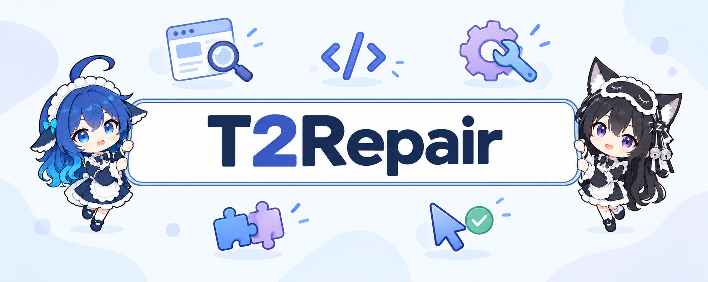
</p>

<h1 align="center">T2Repair</h1>

<p align="center">
  <strong>Thinking It Through and Trying It Out for Visual Bug Repair</strong>
</p>

<p align="center">
  <a href="#overview">Overview</a> ·
  <a href="#results">Results</a> ·
  <a href="#case-study">Figure 8</a> ·
  <a href="#getting-started">Get started</a> ·
  <a href="figures/README.md">Paper PDFs</a> ·
  <a href="code/causalgui/">Code</a>
</p>

T2Repair combines **source-code investigation** with **runtime reproduction** to repair visual bugs in JavaScript projects. A screenshot provides the symptom. The Code Agent investigates how the implementation produces it, while the Browser Agent runs the program and checks what actually happens. Their evidence guides a separate patch generator.

## Overview

<p align="center">
  <a href="figures/fig3-framework.pdf">
    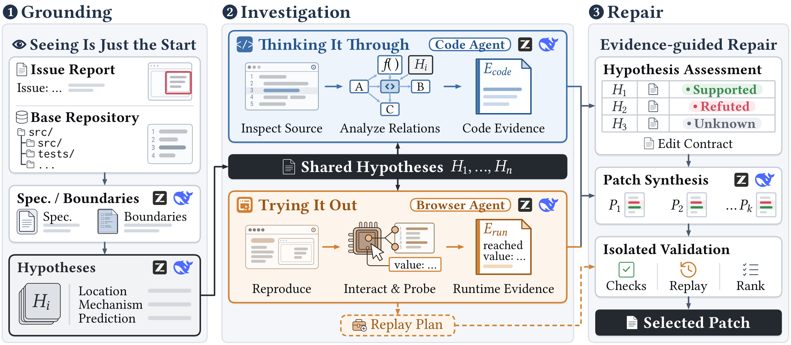
  </a>
</p>

*Figure 3. The T2Repair workflow. Click any paper figure to open its original PDF.*

1. **Ground the issue:** derive requirements from the issue and images, index the base source, and form shared debugging hypotheses.
2. **Investigate:** run the Code Agent and then the Browser Agent in separate contexts. Each follows the shared hypotheses and produces an evidence-linked report.
3. **Generate:** combine both reports and tool observations to produce five candidate patches.
4. **Check and replay:** validate candidates and replay the frozen browser scene without further model calls. Keep `UNKNOWN` when the available checks cannot establish a result.

The default budgets are **2 Code Agent calls**, **3 Browser Agent calls**, and **5 candidates**, with seed **42**. Each agent's final call is reserved for its report. The agents do not edit the target source or revise each other's reports. GLM and DeepSeek are interchangeable backends; the same configured backend serves both roles in a run.

## Motivation

Visual bugs can involve layout, rendering, and parsing behavior. The visible symptom is the starting point for investigating the computation behind it.

<p align="center">
  <a href="figures/fig1-visual-scenarios.pdf">
    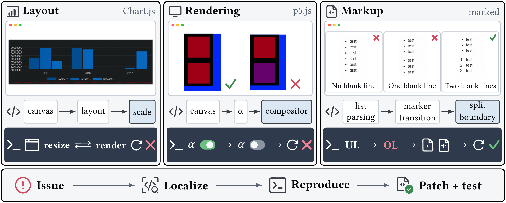
  </a>
</p>

*Figure 1. Illustrative visual-bug scenarios and the investigation process.*

In `bpmn-io__bpmn-js-1299`, an empty label edit can change the geometry of the underlying event. Reading the code identifies the guard and resize path; execution is needed to check the affected state.

<p align="center">
  <a href="figures/fig2-motivating-example.pdf">
    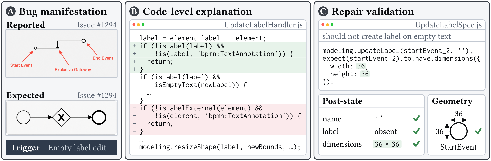
  </a>
</p>

*Figure 2. Reported behavior, code-level explanation, and reference repair/test expectations for the motivating example.*

## Thinking It Through

The **Code Agent** follows the shared hypotheses through definitions, callers, dependencies, and state changes. It identifies relevant implementation paths and supplies evidence-linked findings, repair suggestions, and preservation constraints to the patch generator.

<p align="center">
  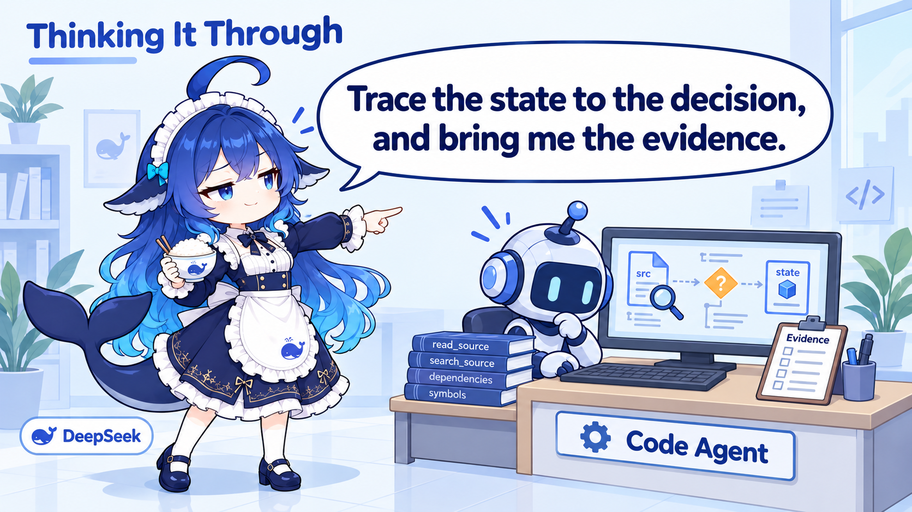
</p>

<p align="center">
  <a href="figures/fig4-code-investigation.pdf">
    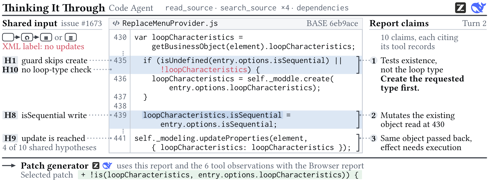
  </a>
</p>

*Figure 4. Thinking It Through: source inspection connects suspicious behavior to candidate edit locations and constraints.*

## Trying It Out

The **Browser Agent** loads the real base program, builds a reproduction, and interacts with it to collect runtime values and interface observations. It can refine the reproduction within its call budget. Its final scene and completed actions are frozen for replay on candidate patches.

<p align="center">
  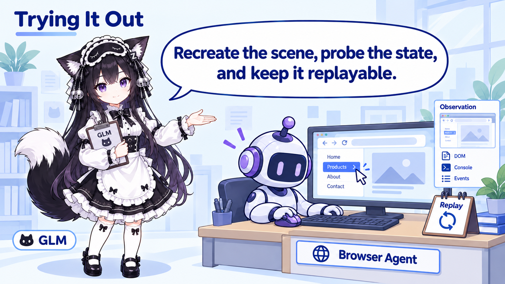
</p>

<p align="center">
  <a href="figures/fig5-browser-investigation.pdf">
    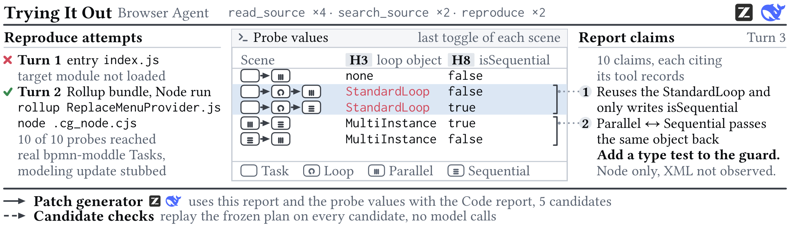
  </a>
</p>

*Figure 5. Trying It Out: execution checks the hypotheses against observed behavior and preserves a replayable scene.*

*DeepSeek and GLM personify the roles in these illustrations. The implementation uses a shared, configurable backend for both agents.*

## Results

The paper reports the following T2Repair results on the **480-task SWE-bench Multimodal v2 test set**:

| Model backend | Resolved tasks | Resolution rate |
| --- | --- | --- |
| GLM | **168 / 480** | **35.00%** |
| DeepSeek | **161 / 480** | **33.54%** |

<p align="center">
  <a href="figures/fig6-repair-overlap.pdf">
    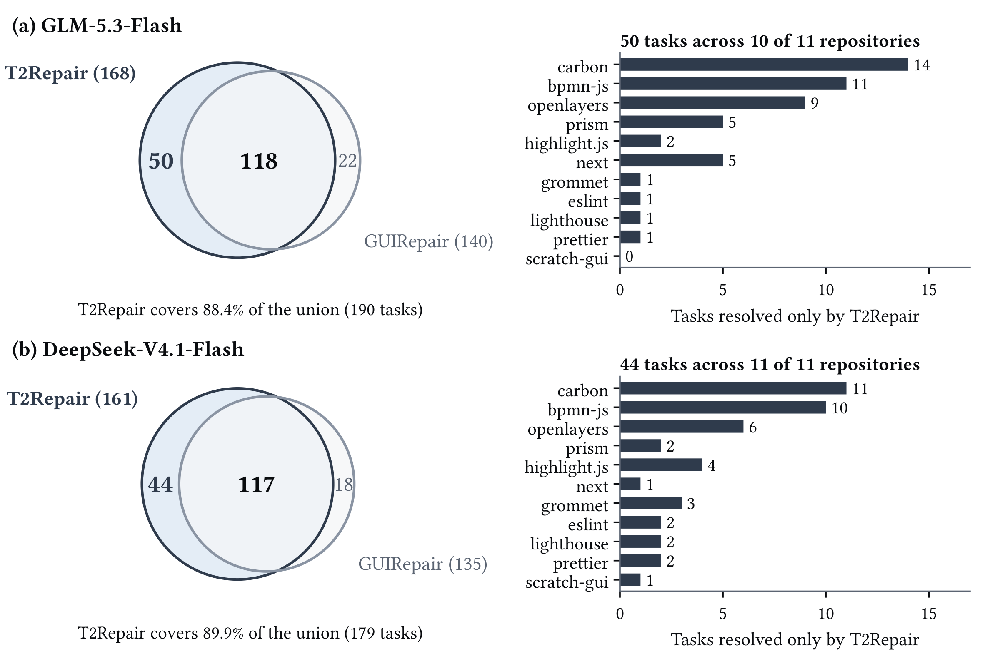
  </a>
</p>

*Figure 6. Tasks resolved by T2Repair and GUIRepair, including the distribution of T2Repair-only repairs across repositories.*

The two ablations remove either the Code Agent or the Browser Agent together with that role's call budget. Removed calls are not reassigned to the remaining role.

<p align="center">
  <a href="figures/fig7-ablation-overlap.pdf">
    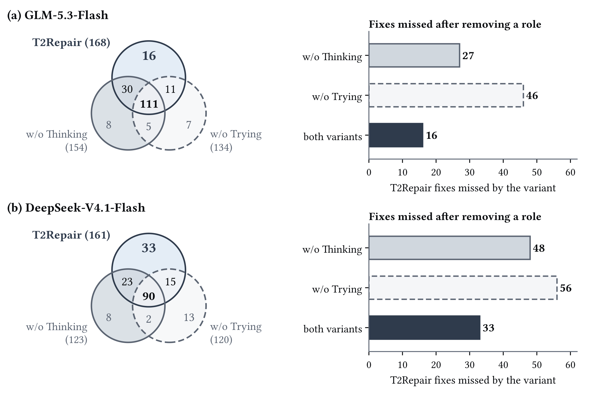
  </a>
</p>

*Figure 7. Repair overlap between the full method and its two agent ablations.*

## Case study

<p align="center">
  <a href="figures/fig8-repair-trajectory.pdf">
    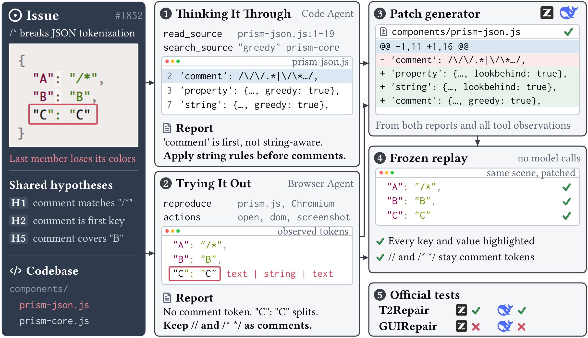
  </a>
</p>

*Figure 8. The recorded DeepSeek repair trajectory for `PrismJS__prism-1853` (original report: `Issue #1852`).*

On `PrismJS__prism-1853`, source inspection suggests that a comment rule interferes with strings containing `/*`. Browser execution reveals a more precise failure: the final `"C":"C"` member splits into **text → string → text**, with no comment token in the issue output. It also establishes that real comments must still work.

The selected patch restores **property → operator → string**, and frozen replay preserves the line/block comment controls. The archived official evaluation records a pass. Read the [trajectory walkthrough](trajectories/fig8-prism-1853/README.md) to follow the original requests, observations, patch, and replay, including checks that remain unknown.

## Getting started

To run T2Repair on a new case, build the Linux runtime:

```bash
docker build -t t2repair:local .
```

Then follow [Run T2Repair](docs/RUNNING.md) to prepare a base checkout and issue images, install the target project's dependencies, configure an OpenAI-compatible model endpoint, and run `prepare → check → run → export`. The same configured backend serves both investigation roles and patch generation.

A repair run calls the configured model endpoint. The launcher runs one case at a time, with official benchmark evaluation as a separate step.

## Repository guide

| Resource | Contents |
| --- | --- |
| [Implementation](code/causalgui/) | Current T2Repair method and standalone launcher |
| [Running guide](docs/RUNNING.md) | Setup, inputs, configuration, ablations, and evaluation |
| [Paper figures](figures/README.md) | All eight original PDFs |
| [Figure 8 archive](trajectories/fig8-prism-1853/README.md) | Recorded investigation, candidates, patch, and replay |
| [Release contents](docs/RELEASE.md) | Source provenance and archived artifacts |

<details>
<summary>Implementation map</summary>

| Location | Purpose |
| --- | --- |
| [code/causalgui/front.py](code/causalgui/front.py) | Base-source indexing, candidate boundaries, and grounded input construction |
| [code/causalgui/code_agent.py](code/causalgui/code_agent.py) | Source tools, inspection contexts, and repair scope |
| [code/causalgui/browser_agent.py](code/causalgui/browser_agent.py) | Runtime scenes, browser actions, observations, replay, and candidate checks |
| [code/causalgui/feedback.py](code/causalgui/feedback.py) | Evidence projection into bounded tool feedback |
| [code/causalgui/s5_context.py](code/causalgui/s5_context.py) | Evidence-aware patch-generator context |
| [code/causalgui/synthesis.py](code/causalgui/synthesis.py) | Atomic candidate edits and patch construction |
| [code/causalgui/main.py](code/causalgui/main.py) | Schemas, model calls, investigation, candidate generation, and selection |
| [code/causalgui/cli.py](code/causalgui/cli.py) | Standalone release commands |
| [trajectories/fig8-prism-1853/](trajectories/fig8-prism-1853/) | Recorded Figure 8 evidence |

`causalgui` is the implementation's internal Python package name. See [release contents](docs/RELEASE.md) for code and archive provenance.

</details>
